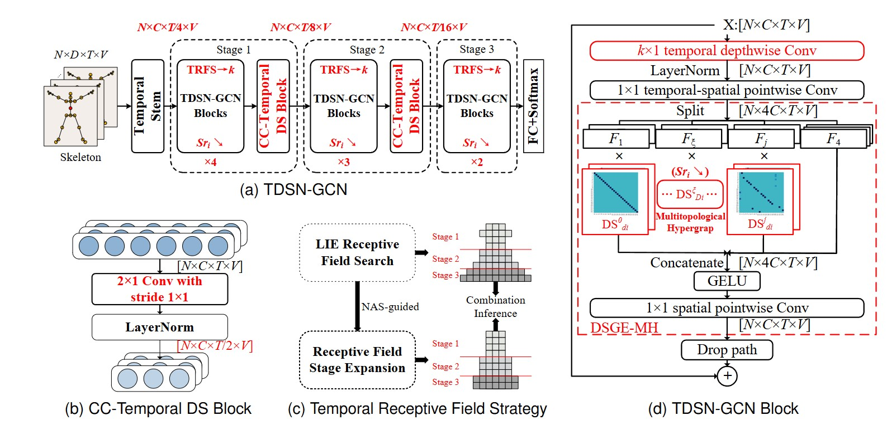
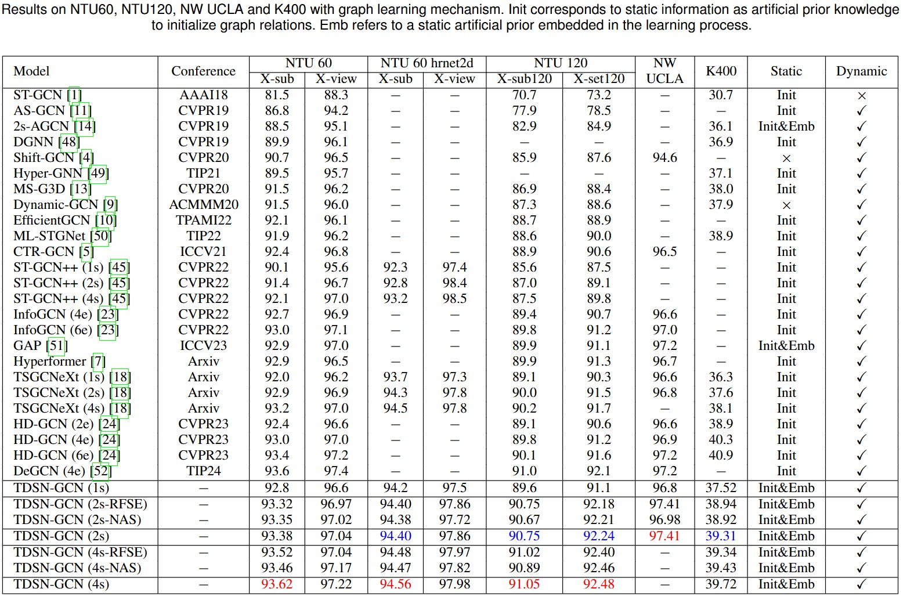

# TDSN-GCN
TDSN-GCN: Transformerify Decaying Static Graph Embedding NAS-guided GCN for Skeleton Action Recognition

Part of the core code will be made public after the paper is received.

## Architecture

### Results

